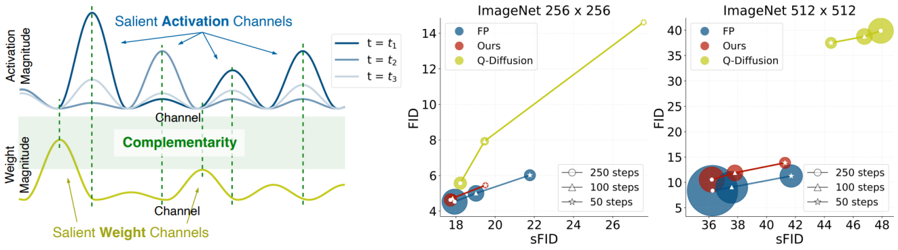

# Official Repository of [PTQ4DiT: Post-training Quantization for Diffusion Transformers](https://arxiv.org/abs/2405.16005) [NeurIPS 2024]



## Usage

### Environment Setup

```bash
conda activate modelsmith
conda env update --file environment.yml --name modelsmith
```

### Pre-trained DiT Checkpoints

The pre-trained DiT checkpoints can be downloaded from the [original repository](https://github.com/facebookresearch/DiT?tab=readme-ov-file#sampling--).
We then place these model weights, named `DiT-XL-2-256x256.pt` and `DiT-XL-2-512x512.pt`, under `pretrained_models/`.

### Calibration Data

Use the following command to generate calibration datasets.

```bash
mkdir calib

python get_calibration_set.py --model DiT-XL/2 --image-size 256 \
--ckpt pretrained_models/DiT-XL-2-256x256.pt \
--num-sampling-steps 50 \
--outdir calib/ --filename imagenet_DiT-256_sample4000_50steps_allst.pt \
--cfg-scale 1.5 --seed 1
```

For other settings, please change `--image-size` and `--num-sampling-steps`.

### Quantization

- Example of quantizing DiT-XL/2 with 50 timesteps into W8A8 on ImageNet 256x256 generation.

```bash
python quant_sample.py --model DiT-XL/2 --image-size 256 \
--ckpt pretrained_models/DiT-XL-2-256x256.pt \
--num-sampling-steps 50 \
--weight_bit 8 --act_bit 8 --cali_st 25 --cali_n 64 --cali_batch_size 32 --sm_abit 8 \
--cali_data_path calib/imagenet_DiT-256_sample4000_50steps_allst.pt --outdir output/ \
--cfg-scale 1.5 --seed 1 --ptq --recon
```

To specify other bit-widths, please change `--weight_bit` and `--act_bit`.
For different numbers of timesteps, please change `--num-sampling-steps` and use the corresponding calibration data by changing `--cali_data_path`.

- Example of quantizing DiT-XL/2 with 50 timesteps into W4A8 on ImageNet 512x512 generation.

```bash
python quant_sample.py --model DiT-XL/2 --image-size 512 \
--ckpt pretrained_models/DiT-XL-2-512x512.pt \
--num-sampling-steps 50 \
--weight_bit 4 --act_bit 8 --cali_st 10 --cali_n 128 --cali_batch_size 16 --sm_abit 8 \
--cali_data_path calib/imagenet_DiT-512_sample4000_50steps_allst.pt --outdir output/ \
--cfg-scale 1.5 --seed 1 --ptq --recon
```

### Inference

- Example of DiT-XL/2 with 50 timesteps and W8A8 for ImageNet 256x256 generation.

```bash
python quant_sample.py --model DiT-XL/2 --image-size 256 \
--ckpt pretrained_models/DiT-XL-2-256x256.pt \
--num-sampling-steps 50 \
--weight_bit 8 --act_bit 8 --cali_st 25 --cali_n 64 --cali_batch_size 32 --sm_abit 8 \
--cali_data_path calib/imagenet_DiT-256_sample4000_50steps_allst.pt --outdir output/ \
--cfg-scale 1.5 --seed 1 \
--resume --cali_ckpt output/256_88_50/ckpt.pth \
--ptq \
--inference --n_c 10
```

- Example of DiT-XL/2 with 50 timesteps and W4A8 for ImageNet 512x512 generation.

```bash
python quant_sample.py --model DiT-XL/2 --image-size 512 \
--ckpt pretrained_models/DiT-XL-2-512x512.pt \
--num-sampling-steps 50 \
--weight_bit 4 --act_bit 8 --cali_st 10 --cali_n 128 --cali_batch_size 16 --sm_abit 8 \
--cali_data_path calib/imagenet_DiT-512_sample4000_50steps_allst.pt --outdir output/ \
--cfg-scale 1.5 --seed 1 \
--resume --cali_ckpt output/512_48_50/ckpt.pth \
--ptq \
--inference --n_c 5
```

### Evaluation

We use the [ADM’s TensorFlow evaluation suite](https://github.com/openai/guided-diffusion/tree/main/evaluations) to calculate FID, sFID, IS, and Precision.

## TODO

Please stay tuned!

- [x] Release core code of PTQ4DiT
- [x] Release the code for calibration data preparation
- [] Release implementation of Re-Parameterization for fast inference

## Citation

If you find PTQ4DiT useful or relevant to your project and research, please kindly cite our paper:)

```bibtex
@inproceedings{wu2024ptq4dit,
  title={PTQ4DiT: Post-training Quantization for Diffusion Transformers},
  author={Wu, Junyi and Wang, Haoxuan and Shang, Yuzhang and Shah, Mubarak and Yan, Yan},
  booktitle={NeurIPS},
  year={2024}
}
```
